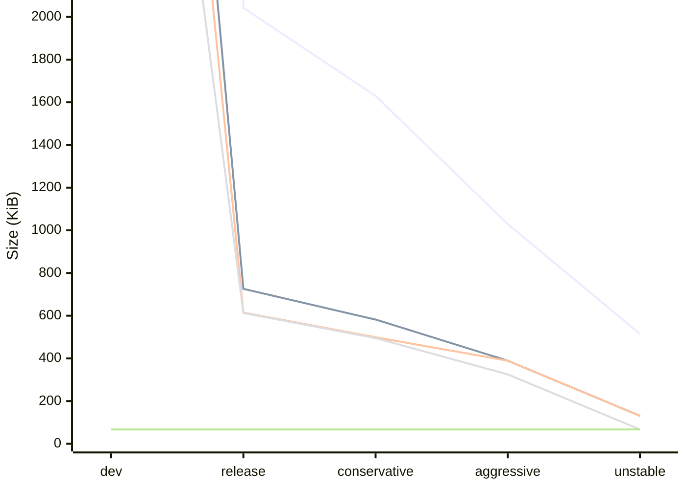

# Managing the size of Rust binaries

TL;DR: Rust binaries tend to be large, but their size can greatly be reduced.
Read [techniques](#techniques) to see by how much and learn how.

## Table of Contents

- [**Introduction**](#introduction)
- [**Techniques**](#techniques)
  - [**Build options**](#building-with-the-most-aggressive-profile-the-use-case-allows)
  - [**Default features**](#disabling-expensive-and-unused-features-in-dependencies)
  - [**Dead-code elimination**](#removing-direct-and-indirect-usages-of-expensive-functions)
  - [**Replacing dependencies**](#replacing-dependencies-that-are-not-amenable-to-optimization)
  - [**Rewriting code**](#rewriting-code-using-space-efficient-patterns)
- [**Considerations**](#considerations)
  - [**Target and compression**](#target-and-compression)
- [**Related work**](#related-work)
- Anecdotes
  - [**Hello, Syslog!**](anecdotes/optimizing-hello-syslog.md)

## Introduction

Rust binaries are notoriously large: even a simple “Hello, World!” program often compiles to around 4MB [^the-size-of-hello-world].
While this size is generally acceptable for desktop applications [^desktop-hardware], it can be a deal-breaker for embedded systems.
This project is intended for developers working in the space between these two extremes.

Specifically, the project is developed in the context of the AXIS Camera Application Platform (ACAP) [^acap], which enables third-party developers to deploy applications directly to Axis cameras and similar devices.
Although these devices can typically accommodate a single large application, it’s common—and often necessary—to run multiple applications concurrently, making efficient use of limited storage a critical concern.

The goals of this project are:

To document methods for reducing the size of Rust binaries, detailing the trade-offs and implementation strategies involved.
To assess Rust’s viability in resource-constrained environments traditionally dominated by C and C++.

## Techniques

Below are several techniques for reducing the size of Rust binaries, roughly ordered by their expected return on investment.

The chart illustrates how various optimizations impact the size of an example application [^the-size-of-hello-syslog-on-aarch64]:

The `dev` profile is intentionally left off the chart to underscore that it is ridiculously large and largely irrelevant.
The lines are in order from top to bottom:
1. The initial implementation
2. After disabling unnecessary features.
3. After also making some expensive functions unreachable.
4. After also replacing a heavy dependency with a lightweight one.
5. The C reference (a flat line along the bottom because it does not interact with the Rust build options)

See the [Optimizing Hello, Syslog!](anecdotes/optimizing-hello-syslog.md) anecdote for details on how the code changed and why.

### Building with the most aggressive profile the use case allows

The single, best resource to learn about this is _min-sized-rust_ [^min-sized-rust].

### Disabling expensive and unused features in dependencies

Sprinkle `default-features = false`[^dependency-features] in the Cargo manifest.

A less indiscriminate approach is to:
- Use `cargo bloat --crates` to identify heavy dependencies.
- If the heavy dependency is a transient dependency,
  use `cargo tree -i` to identify the direct dependencies that require the crates.
- Look in the direct dependency's Cargo manifest for features that can be disabled.

### Removing direct and indirect usages of expensive functions

The general approach is to:
- Use `cargo bloat` to identify heavy functions.
- Correlate the heavy functions with the source code of the program and its dependencies to see if it can be avoided.

### Replacing dependencies that are not amenable to optimization

The general approach is to:
- Use `cargo bloat --crates` to identify heavy dependencies.
- Look for alternatives with the requisite functionality or implement it directly.

### Rewriting code using space-efficient patterns

Good resources on this topic include:

- _Shrinking `.wasm` Code Size_ [^shrinking-wasm-code-size], and
- _Tighten Rust’s Belt: Shrinking Embedded Rust Binaries_ [^tighten-rusts-belt].

This is a summary of the relevant techniques presented in the above resources:

- Use trait objects (or, more precisely, reduce the amount of instantiated generic code) [^shrinking-wasm-code-size] [^tighten-rusts-belt]
- Don't use trait objects [^tighten-rusts-belt]
- _Don’t Panic_ [^fmt-unreasonably-expensive] [^shrinking-wasm-code-size] [^tighten-rusts-belt]
- Avoid string formatting [^fmt-unreasonably-expensive] [^shrinking-wasm-code-size] [^tighten-rusts-belt]
- Don't use the build in allocator [^shrinking-wasm-code-size]
- Avoid `static mut` [^tighten-rusts-belt]

## Considerations

Things that could trip up an eager practitioner of Rust binary size optimization.

### Target and Compression

Regardless of whether a program is implemented in C or Rust, the target platform can have a large impact on the binary size.
This is especially true for small programs; the C-implementation of "Hello, Syslog!" is **11x** larger on `aarch64` compared to `armv7hf`.
But the difference is less stark when the binaries are compressed.

The table below shows the size of two C-programs when compiled for different targets [^the-size-of-apps-on-different-targets]:

| Size in bytes (compressed)      | Hello, Syslog! | Hello, Webserver! |
|---------------------------------|----------------|-------------------|
| `aarch64-unknown-linux-gnu`     | 68k (2.0k)     | 661k (276k)       |
| `armv7-unknown-linux-gnueabihf` | 5.7k (1.7k)    | 529k (267k)       |
| `x86_64-apple-darwin`           | 34k (1.2k)     | -                 |

<!-- TODO: Do optimizations made for one target typically translate to another? -->

## Related work

_min-sized-rust_ has curated a good list of articles on the topic [^min-sized-rust].

[^acap]: https://developer.axis.com/acap/introduction/what-is-acap/
[^dependency-features]: https://doc.rust-lang.org/cargo/reference/features.html#dependency-features
[^desktop-hardware]: The three most popular apps on the Mac App Store as of writing weigh in at 112MB, 68MB, and 923MB.
[^fmt-unreasonably-expensive]: https://jamesmunns.com/blog/fmt-unreasonably-expensive/
[^min-sized-rust]: https://github.com/johnthagen/min-sized-rust/tree/f1db29c8cf2be1eaba1ee813cfd147a263853614
[^shrinking-wasm-code-size]: https://rustwasm.github.io/docs/book/reference/code-size.html#shrinking-wasm-code-size
[^the-size-of-apps-on-different-targets]: See `the-size-of-apps-on-different-targets.txt` and its make target.
The archives are created to make size calculations easier for dynamically linked binaries.
Note that it has minimal impact on the size of the binary.
[^the-size-of-hello-syslog-on-aarch64]: See `results/the-size-of-hello-syslog-on-aarch64.txt` and its make target
[^the-size-of-hello-world]: I measured the size on the tier 1 targets I was able to build with the dev profile; it was
439KiB (`aarch64-apple-darwin`),
3332KiB (`i686-unknown-linux-gnu`),
3892KiB (`x86_64-unknown-linux-gnu`), and
4041KiB (`aarch64-unknown-linux-gnu`).
[^tighten-rusts-belt]: https://dl.acm.org/doi/pdf/10.1145/3519941.3535075
